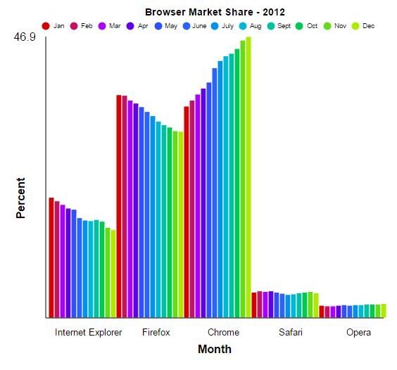

# easyGraphSVG.js
easyGraphSVG.js is a javascript library for creating visually appealing, animated, SVG-only bar graphs from simply formatted JSON data.

## Using easyGraphSVG..js
Using this tool is very simple. All you need to do is include the .js file on the page you want the graph to appear on and pass it correctly formatted data and the element you want to contain the graph (any size works, just set the container element to the size you want the graph to be).

## Data / Options / Styling Formatting

Data should be formatted like this example (for Browser Market Share - 2012):
```
var myGraph = {
    options : {
        title : "Browser Market Share - 2012", // The title of the graph, appears at the top of the page, optional but recommended.
        animation_speed : "faster", // The speed of the animations (Defaults to "normal, "fastest"/"faster"/"normal"/"slow"/"slower"/"slowest")
	animation : true, // true draws the graph with animation enabled, false draws the graph with no animation, already completed.
	x_label : "Month", // The label for the X axis, optional but recommended.
	y_label : "Percent", // The label for the Y axis, optional but recommended.
	data_labels : ["Jan","Feb","Mar","Apr","May","June","July","Aug","Sept","Oct","Nov","Dec"] // Data labels corresponding to each datapoint in succession, optional.
    },
    dataset : [
            {
                label: "Internet Explorer", // The label for this group of data, optional.
		data : [20.1,19.5,18.9,18.3,18.1,16.7,16.3,16.2,16.4,16.1,15.1,14.7] // This group of data as an array
            },
            {
                label: "Firefox",
                data : [37.2,37.1,36.3,35.8,35.2,34.4,33.7,32.8,32.2,31.8,31.2,31.1]
            },
            {
                label: "Chrome",
                data : [35.3,36.3,37.3,38.3,39.3,41.7,42.9,43.7,44.1,44.9,46.3,46.9]
            },
            {
                label: "Safari",
		data : [4.3,4.5,4.4,4.5,4.3,4.1,3.9,4.0,4.2,4.3,4.4,4.2]
            },
            {
                label: "Opera",
                data : [2.1,2.0,2.0,2.1,2.2,2.1,2.2,2.2,2.3,2.3,2.3,2.4]
	    }
    ],
    style : {
	color_array : ["#d50000","#C51162","#AA00FF","#6200EA","#304FFE","#2962FF","#0091EA","#00B8D4","#00BFA5","#00C853","#64DD17","#AEEA00","#FFD600","#FFAB00","#FF6D00","#DD2C00","#3E2723","#212121","#263238"], // Colors alternate for each data point and repeat at each grouping of data
	background_color: "#FFFFFF", // The background color of the graph
	text_color: "#000000" // The text/foreground color of the graph
    }
}
```
The above data (without the comments) will make a graph that looks like this: 

## Displaying Your Graph
When you want your graph to be created and displayed in the page
```
	var graph = document.getElementById("first_graph");
	var my_first_graph =  new easyGraphSVG.makeGraph(myGraph, graph);
	my_first_graph.start();
```

## Interacting With Your Graph

There are a few functions created to interact with a graph created with easyGraphSVG.js
### easyGraphSVG.start()
```
easyGraphSVG.start(); // Draws the graph
```
### easyGraphSVG.clear()
```
easyGraphSVG.clear(); // Removes the graph from the page you created it on. Simply deletes the elements from the container.
```

## Graph Sizing

Due to the incorporation of text in the graph (and keeping the legends readable) I would suggest keeping the graph's container element larger than ~250px in height and larger than 600px in width. However depending on the length of your titles and legend entries it may require more or less space.

## License

MIT License

Copyright (c) 2016 Jeffrey Suchland

Permission is hereby granted, free of charge, to any person obtaining a copy
of this software and associated documentation files (the "Software"), to deal
in the Software without restriction, including without limitation the rights
to use, copy, modify, merge, publish, distribute, sublicense, and/or sell
copies of the Software, and to permit persons to whom the Software is
furnished to do so, subject to the following conditions:

The above copyright notice and this permission notice shall be included in all
copies or substantial portions of the Software.

THE SOFTWARE IS PROVIDED "AS IS", WITHOUT WARRANTY OF ANY KIND, EXPRESS OR
IMPLIED, INCLUDING BUT NOT LIMITED TO THE WARRANTIES OF MERCHANTABILITY,
FITNESS FOR A PARTICULAR PURPOSE AND NONINFRINGEMENT. IN NO EVENT SHALL THE
AUTHORS OR COPYRIGHT HOLDERS BE LIABLE FOR ANY CLAIM, DAMAGES OR OTHER
LIABILITY, WHETHER IN AN ACTION OF CONTRACT, TORT OR OTHERWISE, ARISING FROM,
OUT OF OR IN CONNECTION WITH THE SOFTWARE OR THE USE OR OTHER DEALINGS IN THE
SOFTWARE.

